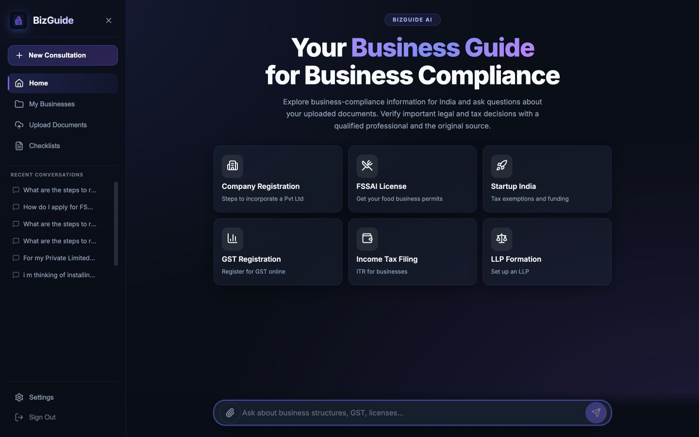
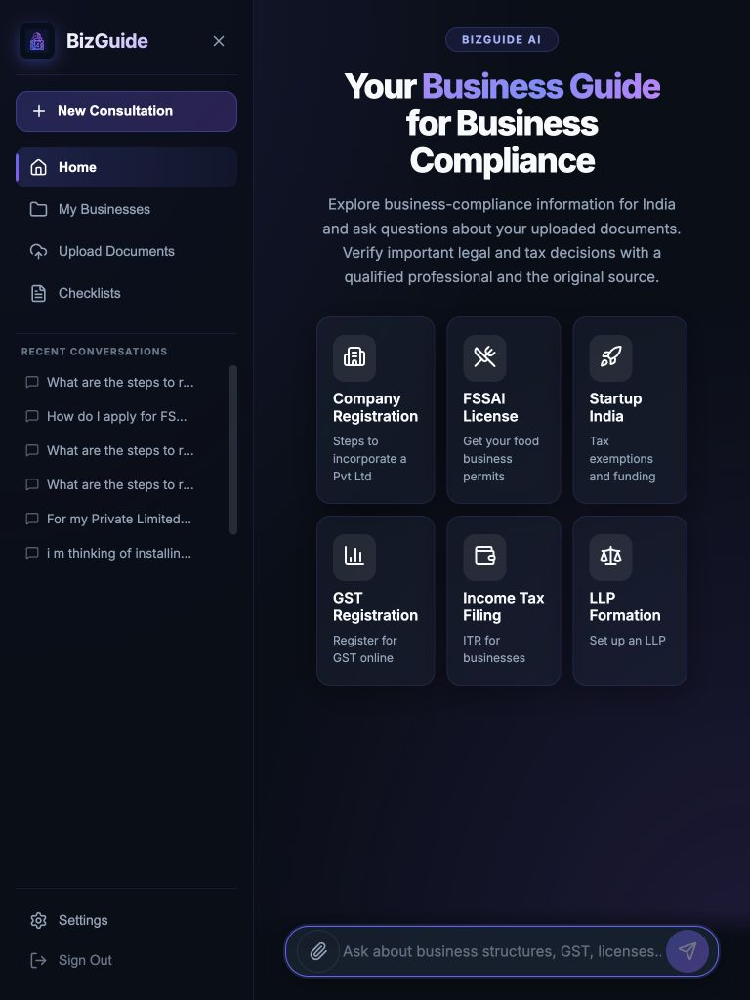
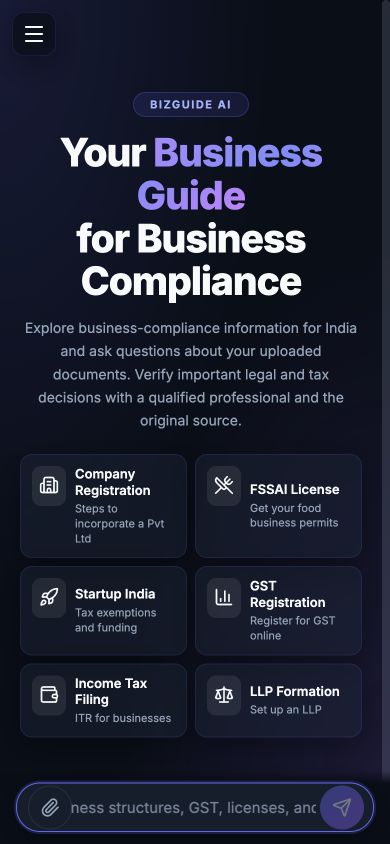
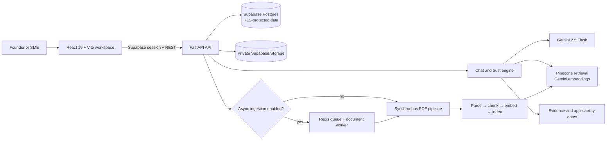

<div align="center">
  
  <h1>BizGuide AI</h1>
  <p><strong>Source-aware business guidance for Indian founders and SMEs</strong></p>
  <p>Ask better questions. Bring the right context. See what supports the answer.</p>

  <p>
    <a href="https://businessrag.vercel.app"></a>
    <a href="https://github.com/Bilal-03/businessrag/actions/workflows/quality.yml"></a>
    <a href="https://businessrag.onrender.com/health"></a>
  </p>

  <p>
    
    
    
    
    
  </p>
</div>

---

> [!IMPORTANT]
> BizGuide AI is an educational-beta product, not a law firm, tax advisor, or substitute for professional advice. Legal, tax, regulatory, deadline, rate, penalty, and eligibility decisions must be checked against the original authority and, where appropriate, a qualified professional.

## Contents

- [What it is](#what-it-is)
- [Product experience](#product-experience)
- [Trust model](#trust-model)
- [Architecture](#architecture)
- [Technology](#technology)
- [Run it locally](#run-it-locally)
- [Environment variables](#environment-variables)
- [API surface](#api-surface)
- [Data and source governance](#data-and-source-governance)
- [Quality checks](#quality-checks)
- [Deployment](#deployment)
- [Project structure](#project-structure)
- [Roadmap and current limits](#roadmap-and-current-limits)
- [Contributing](#contributing)
- [License](#license)

## What it is

BizGuide AI is a source-aware workspace for people building and operating businesses in India. It combines a conversational assistant with business profiles, private document context, a compliance planning surface, and a review workflow for source-backed claims.

The central product decision is simple: context is explicit. A question is answered without silently attaching a business profile or uploaded file. When a user selects context, the answer discloses which context was used and exposes the supporting evidence available to the system.

### The experience in one pass

1. **Create a workspace** and sign in with Supabase Auth.
2. **Add a business profile** with its entity type, industry, state, and operating facts.
3. **Upload source documents** such as registrations, notices, agreements, or internal policy PDFs.
4. **Ask BizGuide** a question and choose whether to include the business profile, documents, or neither.
5. **Read the answer with its evidence state**, assumptions, missing inputs, conflicts, and citations.
6. **Turn reviewed obligations into work** with tasks, due dates, reminders, and evidence tracking.

## Product experience

| Surface | What it does |
| --- | --- |
| **Dashboard** | Shows the active workspace, business context, source inventory, and next actions. |
| **Ask BizGuide** | Provides independent, business-context, or uploaded-document answers with streaming progress and trust metadata. |
| **Businesses** | Stores owner-scoped profiles, jurisdictions, industries, regulated activities, GST facts, workforce bands, and other applicability inputs. |
| **Source Library** | Uploads and inventories private PDFs, tracks processing progress, and keeps documents scoped to their owner and optional business. |
| **Compliance Plan** | Matches published, reviewed obligations to a business profile, explains applicability, surfaces coverage gaps, and supports task planning. |
| **Review Desk** | Gives assigned reviewers and catalog administrators a lifecycle for claims, sources, conflicts, change events, and audit history. |
| **Conversation History** | Persists signed-in conversations, normalized messages, and document citations behind Supabase Row Level Security. |
| **Settings** | Manages the profile, API target, appearance preferences, and local workspace controls. |

The interface is responsive across desktop, tablet, and mobile layouts, with keyboard-operable controls, reduced-motion behavior, focus-visible states, and touch-sized actions.

<p align="center">
  
</p>

<details>
  <summary><strong>See responsive previews</strong></summary>
  <br />
  <p align="center">
    
    
  </p>
</details>

## Trust model

BizGuide separates helpfulness from certainty. The assistant may provide general guidance, but a response is not presented as verified merely because a language model produced it.

### Context modes

| Mode | Meaning |
| --- | --- |
| **General business guidance** | A Gemini answer without the selected business profile or uploaded-document context. |
| **Reviewed compliance** | A business-scoped answer using current, published, reviewed evidence that passed applicability and freshness gates. |
| **User document analysis** | An answer grounded in the user’s selected private documents. Uploaded files are evidence for that user, not official authority. |
| **Professional escalation** | A structured brief that recommends the kind of professional review a question may need. |

### Safeguards

- Business and document context are opt-in per question.
- Official evidence and private uploaded documents are represented as different citation types.
- Evidence statuses distinguish **verified**, **partially supported**, **general guidance**, and **not verified** outcomes.
- High-risk claims, deadlines, rates, thresholds, penalties, and eligibility rules require source passages, effective dates, review ownership, and qualified approvals before publication.
- Changed, unavailable, expired, conflicting, or malformed evidence is quarantined or withheld rather than silently treated as current.
- Business data, conversations, messages, document metadata, and tasks are owner-scoped through Supabase RLS.
- Server credentials stay on the API side. `VITE_*` values are public browser configuration and must never contain secrets.
- The application exposes privacy-safe aggregate metrics and optional Sentry/PostHog integrations without sending prompts, answers, document names, or tokens.

The safeguards are implemented in code, but they do not make the legal catalog complete. Read the [trusted release controls](docs/TRUSTED_BIZGUIDE_RELEASE.md) before treating the product as production compliance infrastructure.

## Architecture



### Request flow

1. The browser authenticates through Supabase and sends a bearer token to the API.
2. The API validates the request, applies owner/business scope, and classifies the question.
3. Only explicitly selected context is assembled. User-uploaded text is treated as untrusted evidence and bounded before it reaches the model.
4. Gemini produces the answer; the trust layer attaches evidence status, citations, assumptions, conflicts, coverage, and escalation guidance.
5. The browser renders the answer and keeps the evidence trail visible without letting it overwhelm the response.

When `ASYNC_DOCUMENT_INGESTION_ENABLED=true`, uploads are written to a private Supabase Storage bucket and queued through Redis. A worker parses, chunks, embeds, and indexes them while the owner-scoped document inventory reports queued, processing, indexed, failed, or deleted status. Without Redis, an in-process queue is available for development; production workers should use Redis and a server-only `SUPABASE_SERVICE_ROLE_KEY`.

## Technology

| Layer | Technologies |
| --- | --- |
| **Frontend** | React 19, Vite 8, Framer Motion, Lucide React, React Markdown, Remark GFM |
| **Backend** | FastAPI, Pydantic Settings, Uvicorn, PyPDF, multipart uploads |
| **AI** | Google Gemini 2.5 Flash for generation; Gemini Embedding 2 for vectors |
| **Retrieval** | Pinecone serverless index with 3,072-dimensional cosine embeddings; LangChain integration |
| **Persistence** | Supabase Auth, Postgres, Row Level Security, private Storage, REST access from the API |
| **Async work** | Redis-backed document queue with a development in-process fallback |
| **Observability** | Structured API metrics, optional Sentry browser errors, optional privacy-safe PostHog events |
| **Quality** | Pytest, Oxlint, Playwright smoke/accessibility/visual suites, migration and source-catalog validators |
| **Hosting** | Vercel for the frontend and Render for the API |

## Run it locally

### Prerequisites

- Node.js 22 LTS and npm
- Python 3.11+
- A Supabase project with the migrations applied in order
- A Google Gemini API key
- A Pinecone API key and index
- Redis only when testing the production-style asynchronous document worker

### 1. Clone and create the backend environment

```bash
git clone https://github.com/Bilal-03/businessrag.git
cd businessrag

python3.11 -m venv .venv
source .venv/bin/activate
python -m pip install --upgrade pip
python -m pip install -r api/requirements.txt

cp .env.example .env
```

Open `.env` and fill in the backend values described in [Environment variables](#environment-variables).

### 2. Apply the database migrations

Apply every SQL migration in `supabase/migrations/` in filename order, through `0014_bilingual_review_controls.sql`. Use a staging Supabase project first and verify authenticated RLS behavior before connecting a production client.

The migration chain is intentionally additive. The active chat and review UI is English-only even though the migration history retains bilingual review fields for compatibility.

### 3. Start the API

```bash
cd api
python -m uvicorn main:app --reload --port 8000
```

The API is available at `http://localhost:8000`. FastAPI’s interactive documentation is available at `http://localhost:8000/docs`.

### 4. Start the frontend

In a second terminal:

```bash
cd businessrag/web
cp .env.example .env
npm install
npx playwright install chromium   # needed for browser tests
npm run dev
```

For a local API, set the following in `web/.env`:

```env
VITE_API_URL=http://localhost:8000
VITE_SUPABASE_URL=https://your-project.supabase.co
VITE_SUPABASE_ANON_KEY=your_supabase_anon_key
```

The frontend runs at `http://localhost:5173`. If `VITE_API_URL` is left at the hosted default, the local UI will call the deployed API instead.

## Environment variables

There are two environment boundaries: the root `.env` is server-only, while `web/.env` is bundled into the browser. Never place Gemini, Pinecone, JWT, admin, or Supabase service-role credentials in a `VITE_*` variable.

### API — root `.env`

Start from [`.env.example`](.env.example). The important values are:

```env
GEMINI_API_KEY=...
GEMINI_MODEL=gemini-2.5-flash
PINECONE_API_KEY=...
PINECONE_INDEX_NAME=bizguide-index-v2

SUPABASE_URL=https://your-project.supabase.co
SUPABASE_ANON_KEY=...
SUPABASE_SERVICE_ROLE_KEY=...   # server-only; needed by async workers
SUPABASE_JWT_SECRET=...         # only for HS256/legacy signing when required
SUPABASE_JWKS_URL=...           # optional; derived from SUPABASE_URL when absent

ENVIRONMENT=development
FRONTEND_URL=http://localhost:5173
METRICS_ENABLED=true
REDIS_URL=                      # optional for local synchronous development
ASYNC_DOCUMENT_INGESTION_ENABLED=false
DOCUMENT_STORAGE_BUCKET=documents
SOURCE_SNAPSHOT_STORAGE_BUCKET=compliance-sources
```

Optional controls include `LOG_LEVEL`, upload limits, rate limits, document worker polling/lease settings, and `ADMIN_SECRET` for the protected administrative clear-all path. See [`.env.example`](.env.example) for the full list.

### Frontend — `web/.env`

Start from [`web/.env.example`](web/.env.example):

```env
VITE_API_URL=https://businessrag.onrender.com
VITE_SUPABASE_URL=https://your-project.supabase.co
VITE_SUPABASE_ANON_KEY=...

# Optional public observability configuration
VITE_SENTRY_DSN=...
VITE_POSTHOG_KEY=...
VITE_POSTHOG_HOST=https://us.i.posthog.com
```

Sentry and PostHog load only when configured. The frontend intentionally disables tracing, replay, pageview autocapture, and input capture; the integration emits only an allow-listed set of coarse workflow events.

## API surface

All `/api/*` routes except health-style probes require a Supabase bearer token. The API also supports `POST /api/chat` as a JSON fallback; the frontend prefers `POST /api/chat/stream` so it can show classification, retrieval, and verification progress before revealing the assembled response.

| Method | Endpoint | Purpose |
| --- | --- | --- |
| `POST` | `/api/chat/stream` | Stream progress events and one complete trust-aware answer. |
| `POST` | `/api/chat` | Return one complete chat response as JSON. |
| `POST` | `/api/answers/feedback` | Store answer feedback for the signed-in owner. |
| `POST` | `/api/documents/upload` | Validate and upload a PDF, synchronously or through the async queue. |
| `GET` | `/api/documents` | List owner-scoped document inventory. |
| `GET` | `/api/documents/{document_id}/status` | Read document/job progress and failure state. |
| `DELETE` | `/api/documents/{document_id}` | Delete the document, storage object, and indexed vectors. |
| `GET` | `/api/workflow/plan` | Read the business-scoped compliance plan and coverage. |
| `GET/POST/PATCH/DELETE` | `/api/workflow/tasks` | Manage planning tasks and their status. |
| `GET/POST/PATCH/DELETE` | `/api/workflow/reminders` | Manage reminder schedules and delivery state. |
| `GET/POST/PATCH` | `/api/review/*` | Role-protected source, claim, conflict, assignment, and audit workflows. |
| `GET` | `/health` | Liveness probe that does not contact external providers. |
| `GET` | `/ready` | Readiness probe with async-worker configuration checks. |
| `GET` | `/metrics` | Optional privacy-safe process and trust-outcome counters. |

### Chat request

```bash
curl -X POST http://localhost:8000/api/chat \
  -H "Authorization: Bearer <supabase-access-token>" \
  -H "Content-Type: application/json" \
  -d '{
    "query": "What should I verify before opening a food business?",
    "business_id": "<business-uuid>",
    "use_business_context": true,
    "use_document_context": false,
    "history": []
  }'
```

The response contract is versioned (`schema_version: 2`) and includes the answer, answer mode, evidence status, citations, context used, assumptions, missing inputs, conflicts, coverage, effective date, and optional professional escalation guidance.

```json
{
  "schema_version": 2,
  "answer": "A concise, source-aware answer...",
  "answer_mode": "reviewed_compliance",
  "evidence_status": "partially_supported",
  "context_used": ["business"],
  "citations": [],
  "assumptions": [],
  "missing_inputs": ["Confirm whether the premises prepare food on site."],
  "conflicts": [],
  "effective_date": "2026-08-16"
}
```

### Persistence notes

Live browser data is stored in normalized Supabase tables behind RLS. On first load after the persistence cutover, the app migrates valid legacy business and conversation records once; stale checklist state and browser-only upload history are intentionally not imported.

## Data and source governance

The repository treats compliance content as a controlled publication pipeline rather than a static checklist.

### Source lifecycle

1. Capture an official source and immutable snapshot.
2. Extract pinpoint passages and record effective dates, hashes, and fetch health.
3. Draft claims and applicability rules against those passages.
4. Assign the appropriate qualified reviewer role: CA, CS, lawyer, sector specialist, or catalog administrator.
5. Approve and publish only when the review and evidence gates pass.
6. Monitor source changes; quarantine affected claims until the change is resolved.

The initial source catalog is deliberately narrow:

| Scope | Source | State |
| --- | --- | --- |
| India | [FSSAI licensing](https://fssai.gov.in/cms/licensing.php) | Published reviewed slice |
| India | [CBIC CGST Rules, 2017](https://cbic-gst.gov.in/pdf/10112020_CGST-Rules-2017_Part-A_Rules.pdf) | Published reviewed slice |
| Delhi | [Delhi Labour inspectorate](https://labour.delhi.gov.in/labour/inspectorate) | Published reviewed slice |
| Maharashtra | [Maharashtra Shops and Establishments Act, 2017](https://mahakamgar.maharashtra.gov.in/Site/Upload/Pdf/Shops_Establishment_Regulation_of_Employment_Conditions_Eng_27.02.2018.pdf) | Reviewed, not yet published |

Only records that are published, current for the requested date, cited, officially sourced, review-owned, and within their effective window may reach the user-facing Compliance Plan. If the schema or evidence is unavailable, the product fails closed and shows the coverage gap.

Read the detailed [source catalog guide](docs/P2_04_SOURCE_CATALOG.md), [trusted release controls](docs/TRUSTED_BIZGUIDE_RELEASE.md), and [implementation status](IMPLEMENTATION_STATUS.md) before changing the publication pipeline.

### Useful data commands

```bash
python scripts/validate_source_catalog.py supabase/seed/obligations.csv
bash scripts/validate_migrations.sh
python scripts/monitor_sources.py
python scripts/check_release_gates.py
```

Apply migrations in filename order through `0014`. Validate with a staging project before any production rollout.

## Quality checks

Backend tests, frontend lint/build, migration validation, source-catalog validation, trust-manifest integrity, and functional Chromium smoke tests run in [GitHub Actions](.github/workflows/quality.yml) on pushes and pull requests targeting `main`. Accessibility and visual regression suites are available locally as additional release evidence.

### Backend

```bash
cd api
PYTHONPATH=. python -m pytest -q tests
```

### Frontend and browser

```bash
cd web
npm run lint
npm run build
npm run test:e2e
npm run test:e2e:accessibility
npm run test:e2e:visual
```

The functional browser suite uses deterministic Supabase and API fixtures; it does not need production credentials or mutate production data. Install Chromium first with `npx playwright install chromium`. Use `npm run test:e2e:debug` or `npm run test:e2e:ui` when investigating a browser failure.

### Release evidence

Before a production promotion, also run:

```bash
python scripts/validate_source_catalog.py supabase/seed/obligations.csv
bash scripts/validate_migrations.sh
python scripts/generate_trust_evaluations.py
python scripts/check_release_gates.py
git diff --check
```

## Deployment

| Service | Role | URL |
| --- | --- | --- |
| **Vercel** | React/Vite frontend with security headers and immutable asset caching | [businessrag.vercel.app](https://businessrag.vercel.app) |
| **Render** | FastAPI backend and optional document worker | [businessrag.onrender.com](https://businessrag.onrender.com) |
| **Supabase** | Auth, Postgres, RLS, private storage, and source/review data | Configure per environment |
| **Pinecone** | User-scoped vector retrieval for uploaded documents | Configure per environment |

### Production checklist

- Set `ENVIRONMENT=production` and an exact `FRONTEND_URL` on the API.
- Configure the frontend `VITE_API_URL`, Supabase URL, and anonymous key in Vercel.
- Keep Gemini, Pinecone, JWT, admin, and Supabase service-role keys on Render only.
- Apply all Supabase migrations in order and verify RLS using unrelated test users.
- Run the source-catalog validator and release-gate command before publishing reviewed content.
- If async ingestion is enabled, configure a private Storage bucket, `SUPABASE_SERVICE_ROLE_KEY`, Redis, and the worker lease/retry settings.
- Expect a cold start on the Render free tier after inactivity; `/health` is intentionally lightweight.
- Confirm Vercel’s CSP, HSTS, clickjacking, MIME-sniffing, referrer, permissions, and COOP headers remain intact through `web/vercel.json`.

## Project structure

```text
businessrag/
├── api/
│   ├── main.py                  # FastAPI app, middleware, routers, metrics
│   ├── config.py                # Server-side settings and environment loading
│   ├── requirements.txt
│   ├── src/
│   │   ├── routes/              # Chat, documents, workflow, knowledge/review, health
│   │   ├── trust/               # Classification, evidence gates, response assembly
│   │   ├── retrieval/           # Owner/business-scoped document retrieval
│   │   ├── ingestion/           # PDF jobs, queue worker, storage lifecycle
│   │   ├── compliance/          # Applicability and due-date logic
│   │   ├── contracts/           # Pydantic request/response contracts
│   │   └── integrations/        # Supabase and provider clients
│   └── tests/                   # Backend contract, trust, workflow, and document tests
├── web/
│   ├── src/
│   │   ├── App.jsx              # Workspace routing, chat, persistence orchestration
│   │   ├── components/          # Sidebar, workspace, source, workflow, review, settings UI
│   │   ├── lib/                 # Supabase, persistence, document jobs, observability
│   │   ├── App.css              # Component and responsive styles
│   │   └── index.css            # Global tokens and accessibility defaults
│   ├── tests/e2e/               # Functional, accessibility, and visual browser suites
│   ├── public/                  # Product logo, icon, and brand assets
│   └── package.json
├── supabase/
│   ├── migrations/              # Ordered schema, RLS, review, and workflow migrations
│   └── seed/obligations.csv     # Controlled source-backed obligation manifest
├── docs/                        # Rollout, accessibility, observability, and source guides
├── evals/                       # Generated trust-evaluation scenarios
├── scripts/                     # Validators, monitoring, migration, and release tooling
├── .github/workflows/quality.yml
├── .env.example
└── README.md
```

## Roadmap and current limits

### Implemented foundation

- Supabase authentication and owner-scoped RLS persistence.
- Source-aware chat with streaming progress, citations, evidence states, and fallback handling.
- Business profiles, applicability inputs, document inventory, async ingestion, and deletion cleanup.
- Compliance Plan foundation with published-obligation gates, coverage messages, tasks, reminders, and evidence history.
- Qualified-review console with source/claim lifecycles, conflict handling, change events, assignments, and audit history.
- Privacy-safe observability, responsive layouts, keyboard/reduced-motion support, browser smoke tests, accessibility checks, and visual baselines.

### Remaining work and external gates

- Complete domain-owner review and coverage for India, Delhi, Maharashtra, and additional industries before any broad compliance claim.
- Complete the 1,000-case trust evaluation review, security/backup drills, and representative SME pilot described in the release controls.
- Add Telugu and Tamil support after the English trust contract is fully reviewed.
- Add business document templates such as MOA, AOA, and MoU.
- Consider a React Native mobile client after the web workflow and source catalog are mature.

The product is intentionally not a complete India-wide legal database, does not infer applicability from a business name alone, and does not endorse a provider. Unsupported or incomplete coverage should remain visible to the user.

## Contributing

Contributions are welcome. For a focused change:

```bash
git checkout -b feature/your-change

# make the change
cd web && npm run lint && npm run build && npm run test:e2e
cd ../api && PYTHONPATH=. python -m pytest -q tests

git add <files>
git commit -m "Describe the change"
git push origin feature/your-change
```

Before opening a pull request:

- Keep migrations ordered and additive; document rollout requirements.
- Add or update deterministic tests for behavior changes.
- Preserve owner scoping, context disclosure, evidence gates, and destructive-action safeguards.
- Do not commit `.env` files, service-role credentials, production tokens, or real user documents.
- Update the relevant document in `docs/` when changing a release, source, accessibility, or observability contract.

## License

This repository currently does not include a `LICENSE` file. Until the project owner adds an explicit license, treat the source as all-rights-reserved and do not assume MIT or other redistribution rights.

<div align="center">
  <br />
  <p><strong>Built for clearer, more accountable business decisions.</strong></p>
  <p>
    <a href="https://businessrag.vercel.app">Live demo</a> ·
    <a href="https://businessrag.onrender.com/health">API health</a> ·
    <a href="https://github.com/Bilal-03/businessrag/issues">Report an issue</a> ·
    <a href="https://github.com/Bilal-03">Bilal on GitHub</a>
  </p>
</div>
